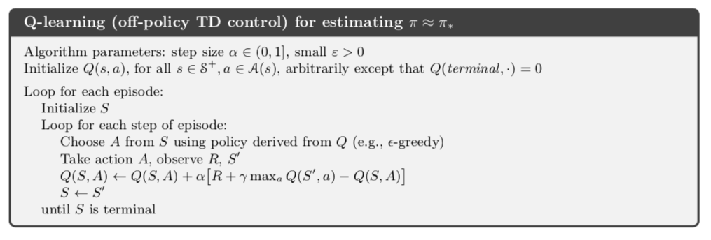

#Q-learning

### Algorithm



Learning Rate alfa = 0.01, reward_decay=0.9, epsilon-greedy=0.9

0.- Initial **observation**:

``` Python
# initial observation
observation = env.reset()        
```

1.- Choose **action** based on observation:

> Choose A from S using policy derived from Q(e.g., e-greedy)

``` Python
# RL choose action based on observation
action = RL.choose_action(str(observation))
```

2.- Take Action A and get next observation and Reward:

>  Take action A, observe R, S'

``` Python
# RL take action and get next observation and reward
observation_, reward, done = env.step(action)
```

3.- Learn from this transition:

``` Python
# RL learn from this transition
RL.learn(str(observation), action, reward, str(observation_))
```

``` Python
 def learn(self, s, a, r, s_):
        self.check_state_exist(s_)
        q_predict = self.q_table.loc[s, a]
        if s_ != 'terminal':
          # q_target = r + gamma*max_aQ(S',a)
            q_target = r + self.gamma * self.q_table.loc[s_, :].max()  # next state is not terminal
        else:
            q_target = r  # next state is terminal
        # Q(S,A) <- Q(S,A) + alfa[r + gamma*max_aQ(S',a) - Q(S,A)]
        # Q(S,A) <- Q(S,A) + alfa[q_target - Q(S,A)]  # alfa is the learning rate: "self.lr"
        # Q(S,A) <- Q(S,A) + self.lr * (q_target - q_predict)
        self.q_table.loc[s, a] += self.lr * (q_target - q_predict)  # update

```


